# 1.  regex** (Regular Expressions)

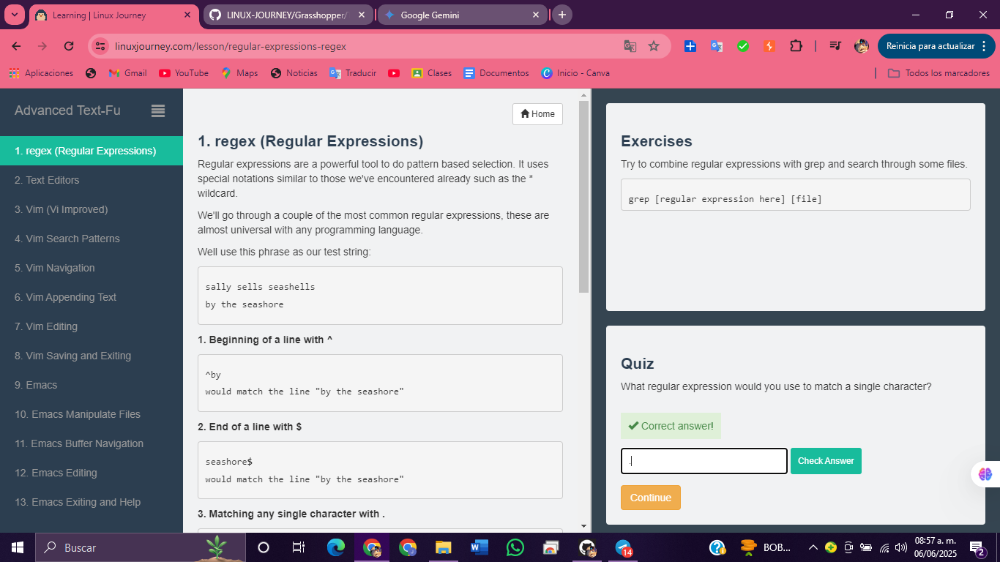

# 2.  Text Editors**

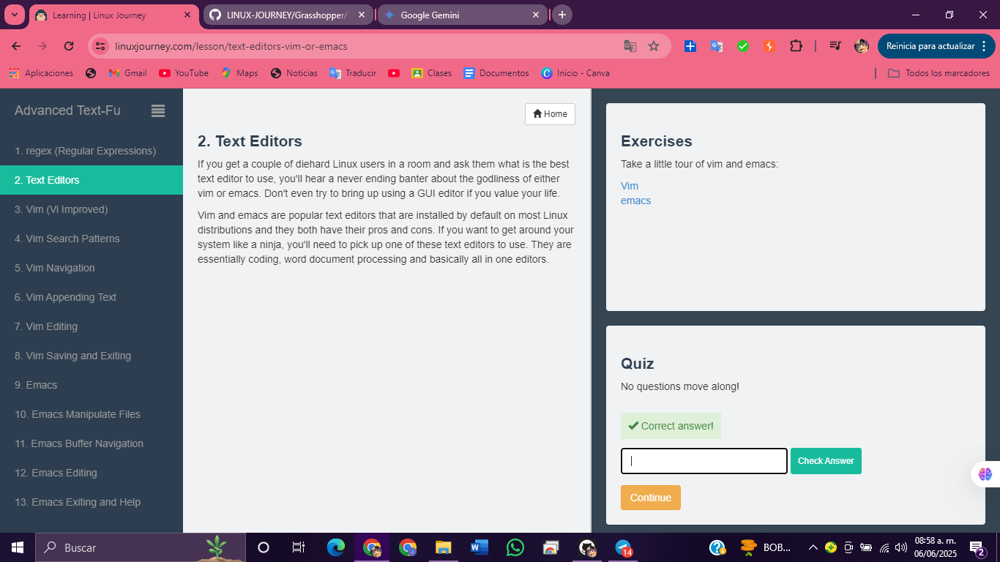

# 3.  Vim** (Vi Improved)

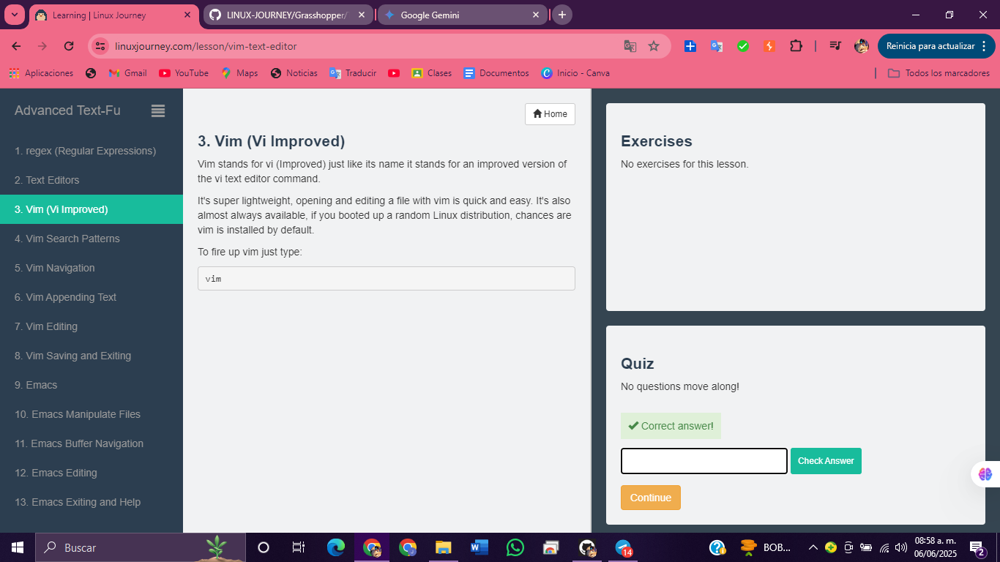

# 4.  Vim Search Patterns**

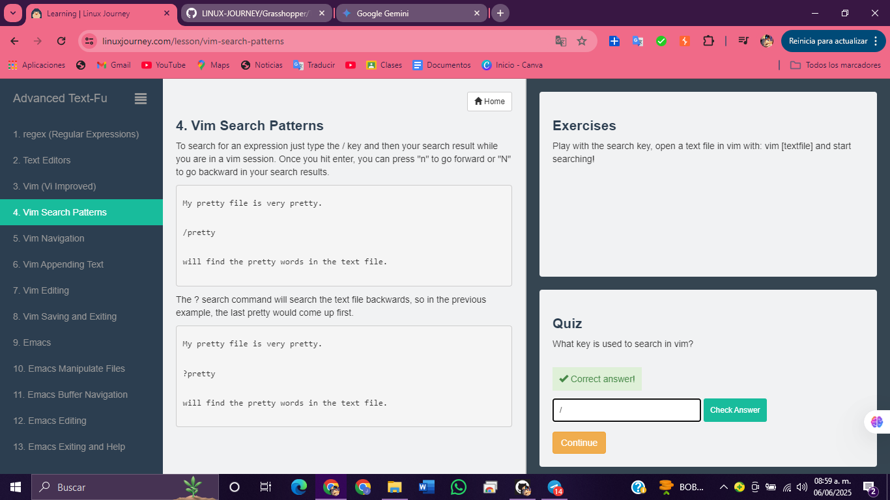

# 5.  Vim Navigation**

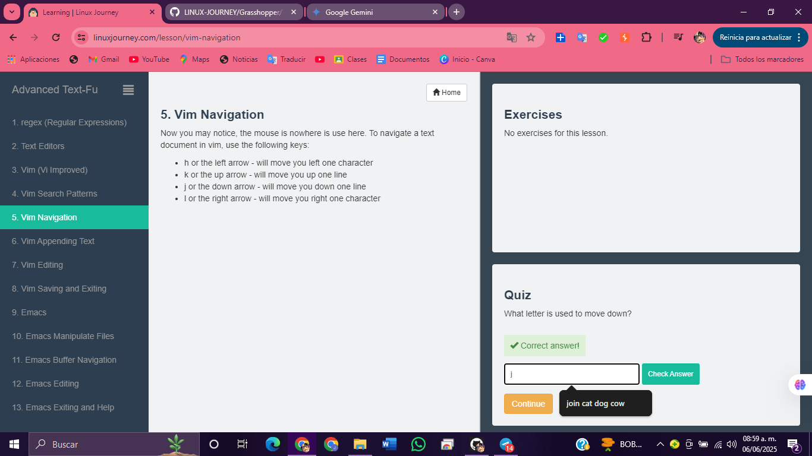

# 6.  Vim Appending Text**

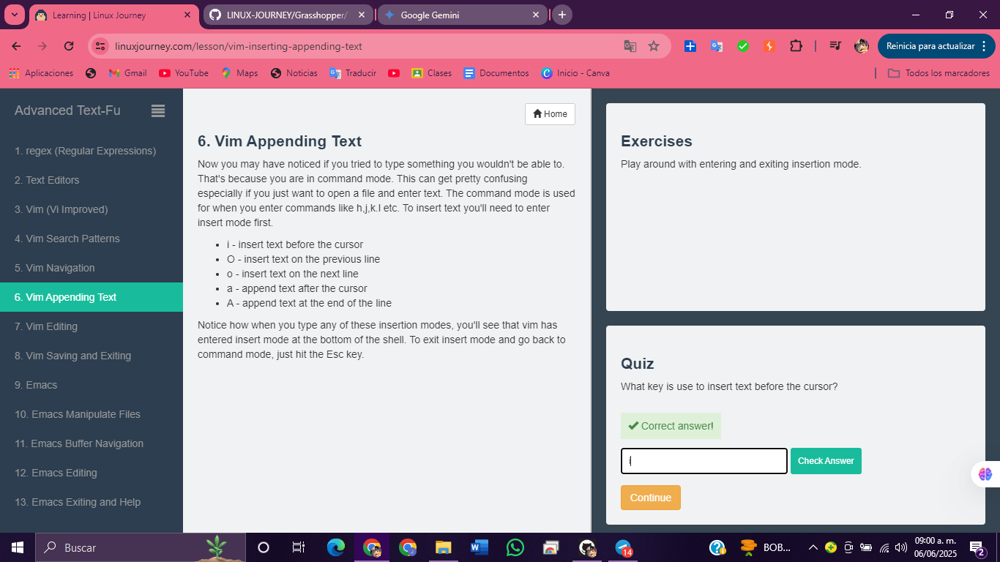

# 7.  Vim Editing**

# 8.  Vim Saving and Exiting**

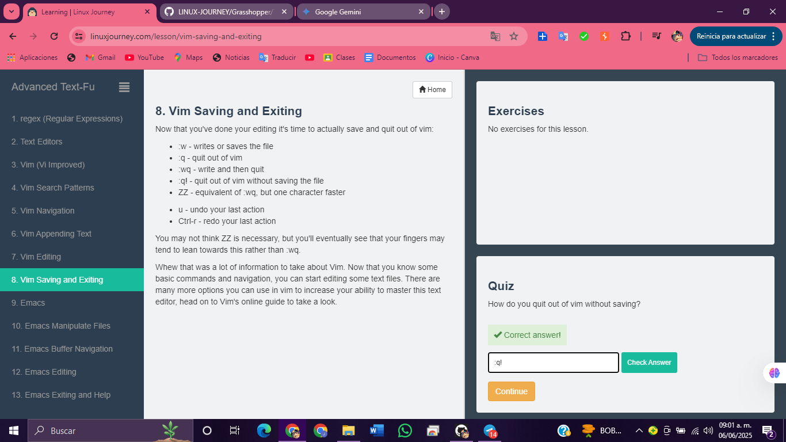

# 9.  Emacs

# 10. Emacs Manipulate Files**

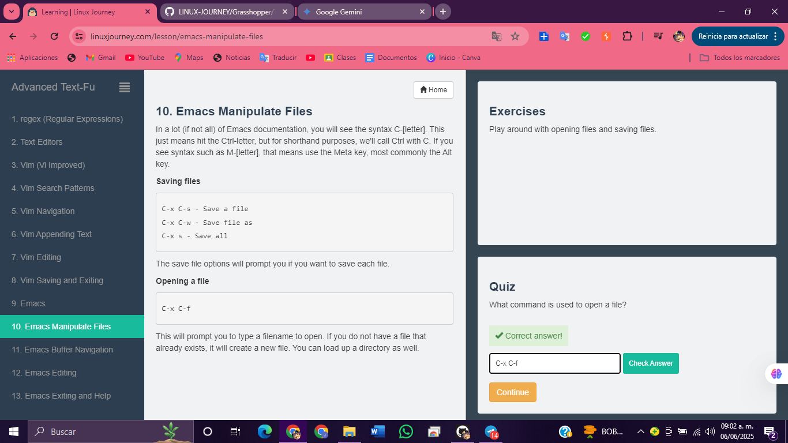

# 11. Emacs Buffer Navigation**

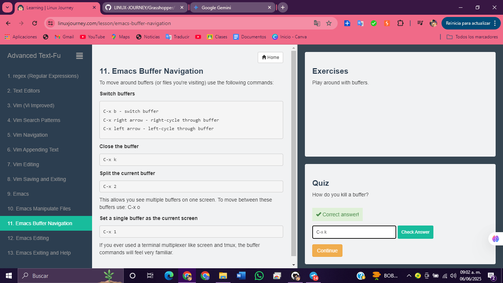

# 12. Emacs Editing**

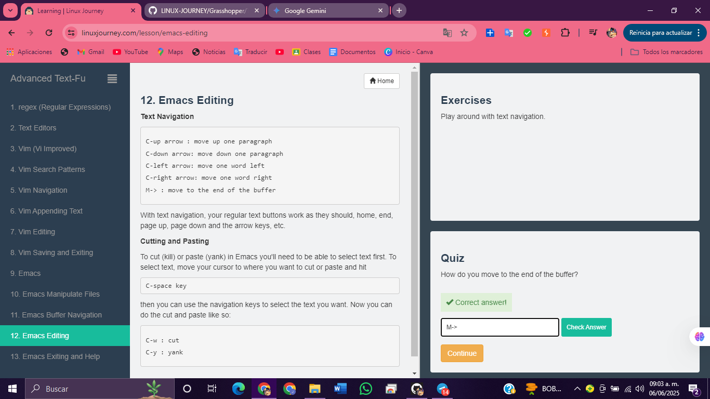

# 13. Emacs Exiting and Help**

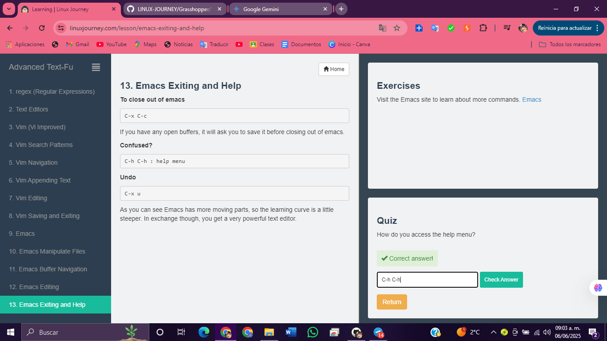