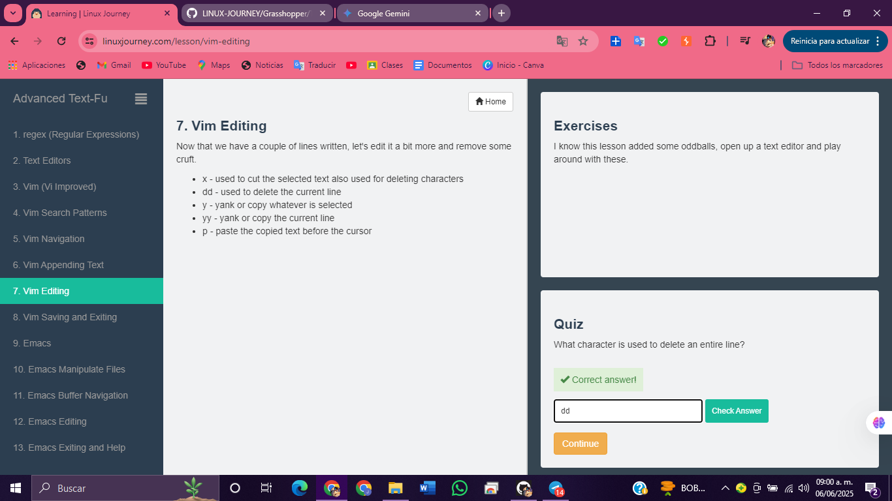
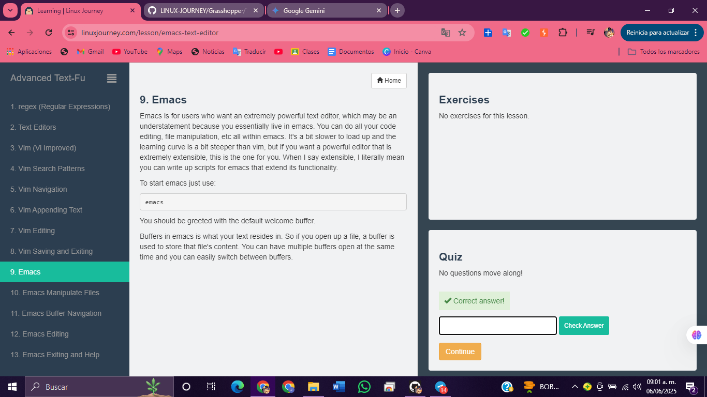

# 1.  regex** (Regular Expressions)

# 2.  Text Editors**

# 3.  Vim** (Vi Improved)

# 4.  Vim Search Patterns**

# 5.  Vim Navigation**

# 6.  Vim Appending Text**

# 7.  Vim Editing**

# 8.  Vim Saving and Exiting**

# 9.  Emacs

# 10. Emacs Manipulate Files**

# 11. Emacs Buffer Navigation**

# 12. Emacs Editing**

# 13. Emacs Exiting and Help**

