# 1.EL SHELL 

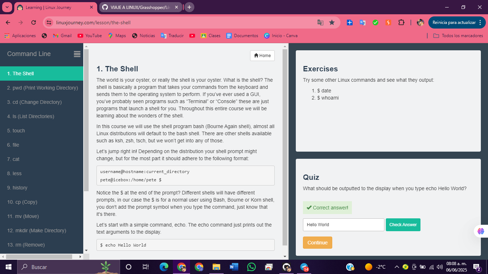

# 2. pwd (Imprimir directorio de trabajo) 

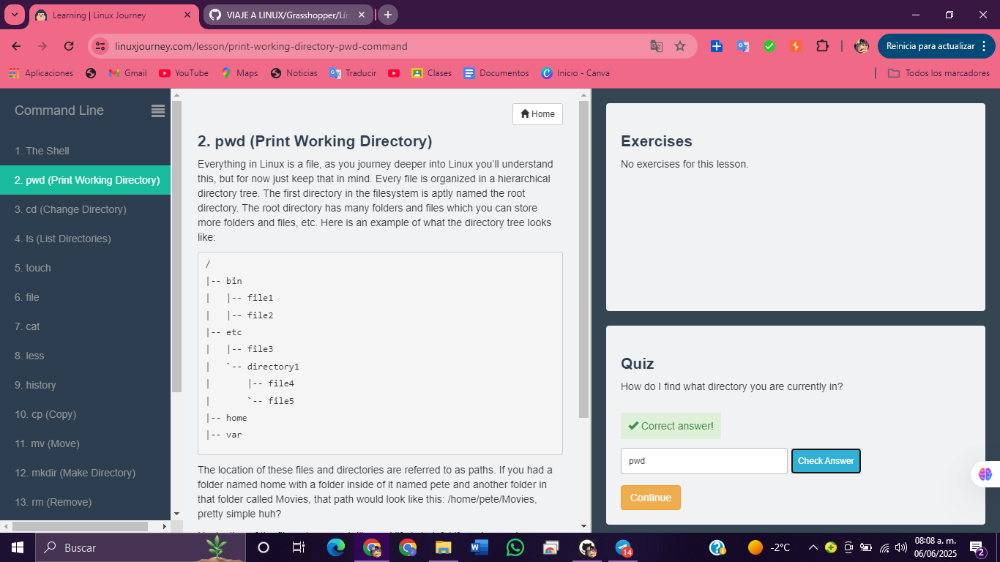

# 3. cd (Cambiar directorio)

# 4. ls (Listar directorios) 

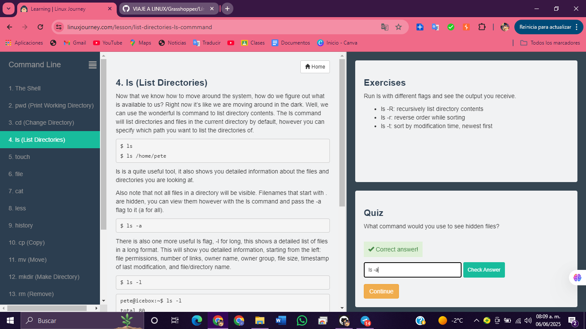

# 5. touch 

# 6. file 

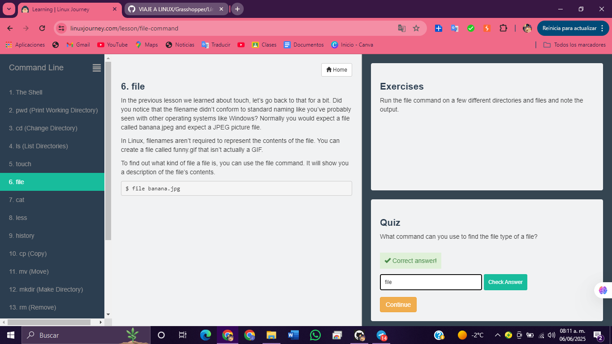

# 7. cat 

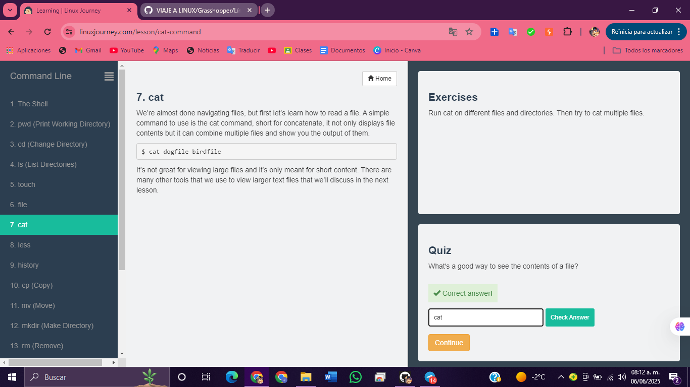

# 8. less 

# 9. HISTORY 

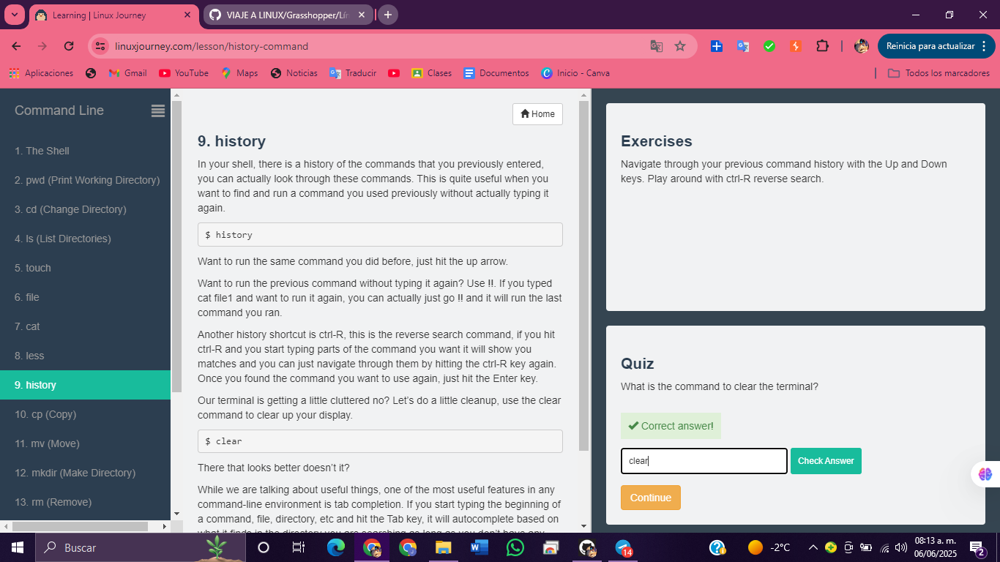

# 10. cp (Copiar) 

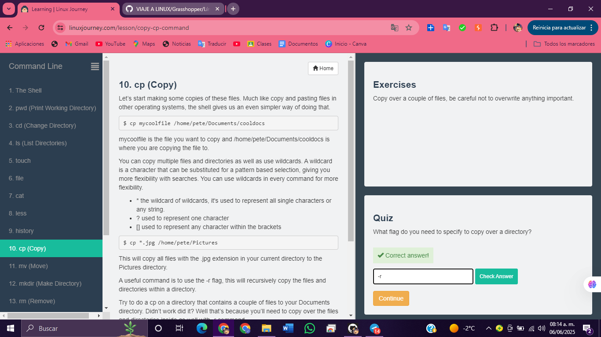

# 11. mv (Mover) 

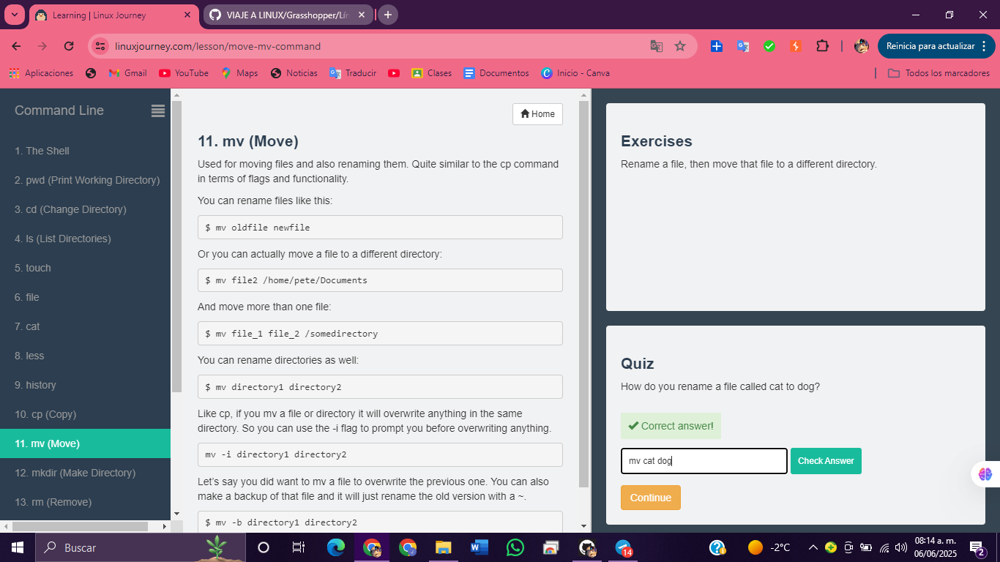

# 12. mkdir (Crear directorio) 

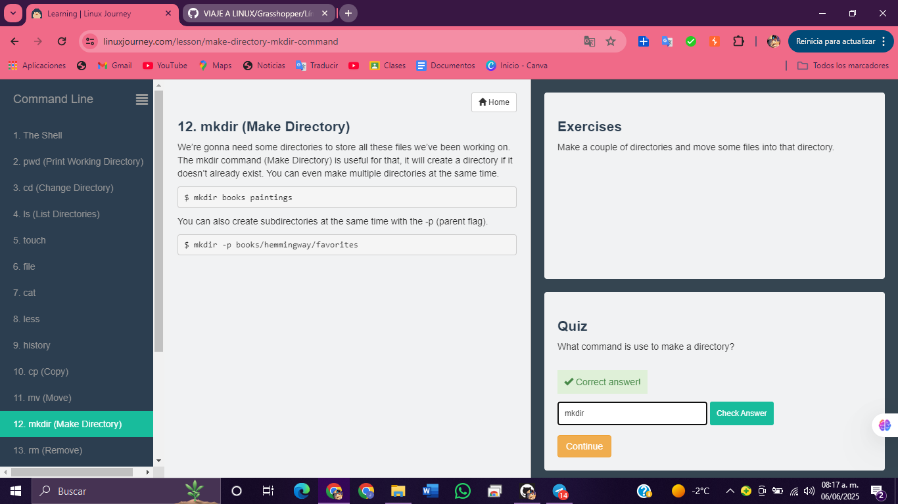

# 13. rm (Eliminar) 

# 14. find 

# 15. help 

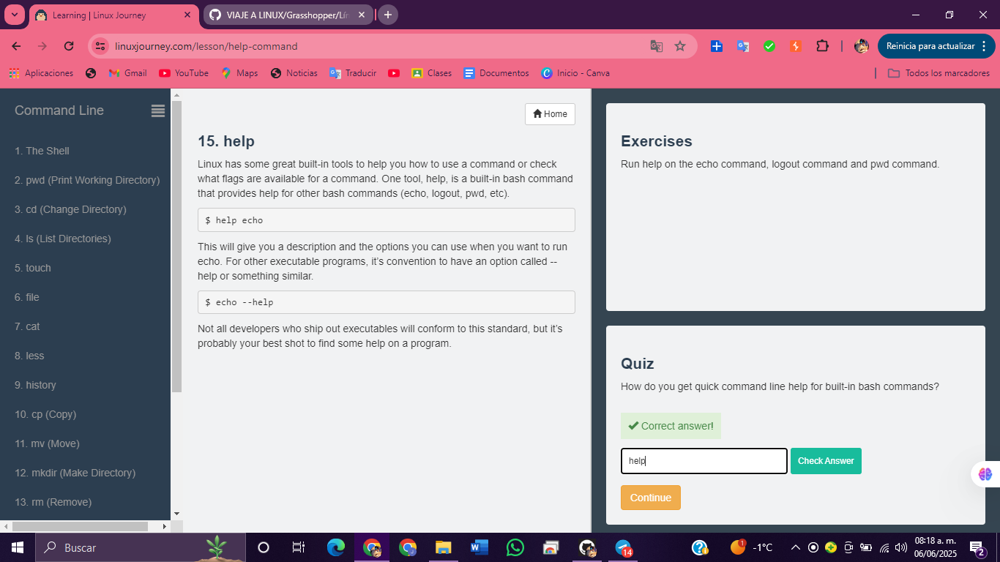

# 16. man

# 17. whatis 

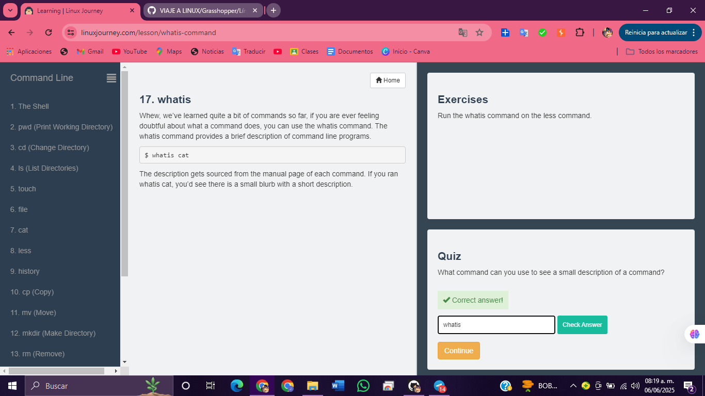

# 18. alias 

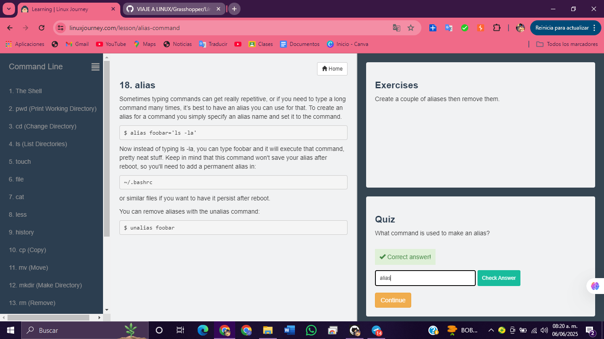

# 19. exit

