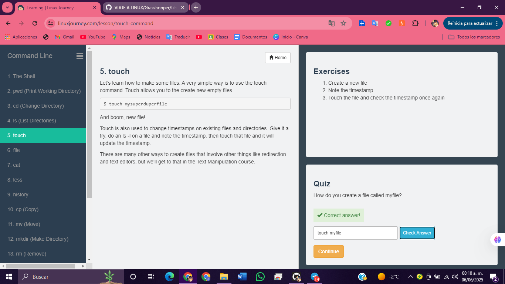
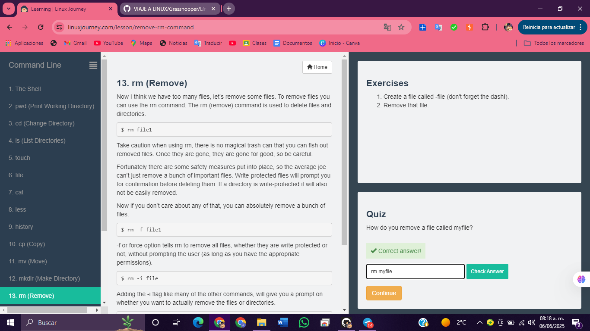

# 1.EL SHELL 

# 2. pwd (Imprimir directorio de trabajo) 

# 3. cd (Cambiar directorio)

# 4. ls (Listar directorios) 

# 5. touch 

# 6. file 

# 7. cat 

# 8. less 

# 9. HISTORY 

# 10. cp (Copiar) 

# 11. mv (Mover) 

# 12. mkdir (Crear directorio) 

# 13. rm (Eliminar) 

# 14. find 

# 15. help 

# 16. man

# 17. whatis 

# 18. alias 

# 19. exit

