# 1.  ps (Processes)

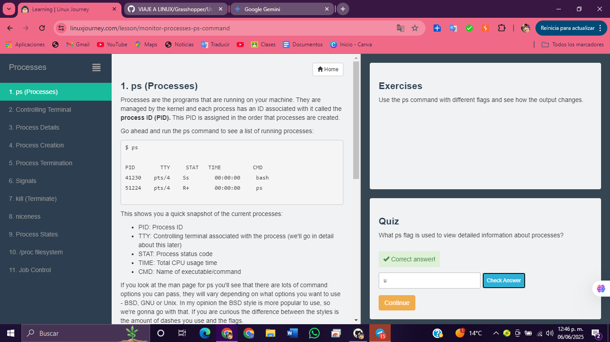

# 2.  Controlling Terminal

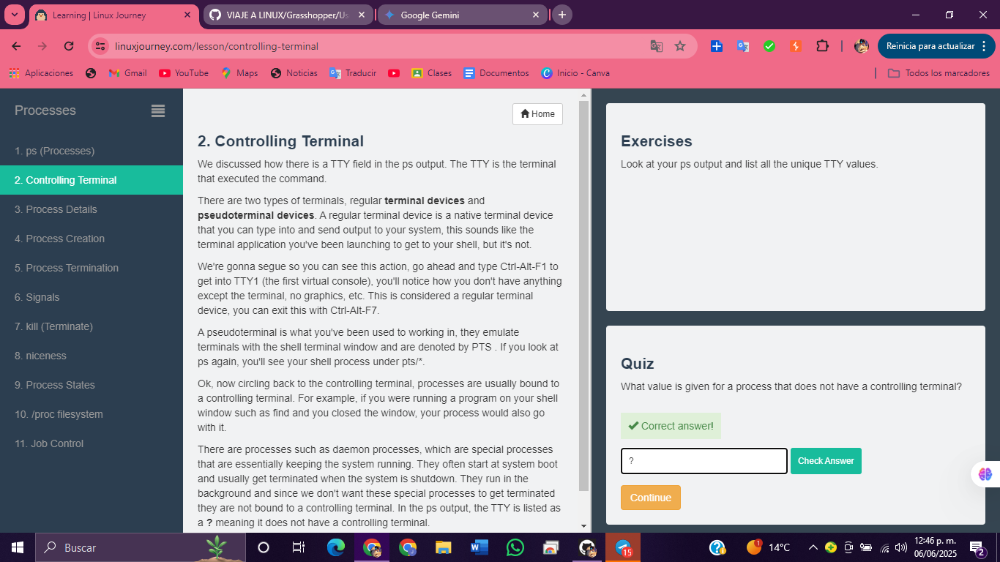

# 3.  Process Details

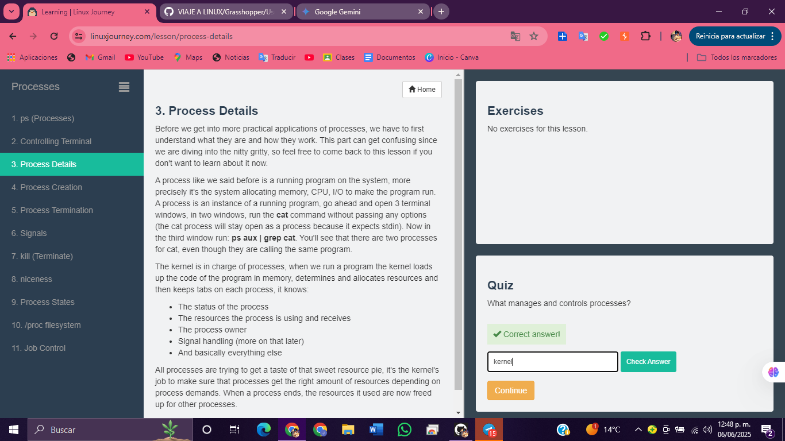

# 4.  Process Creation

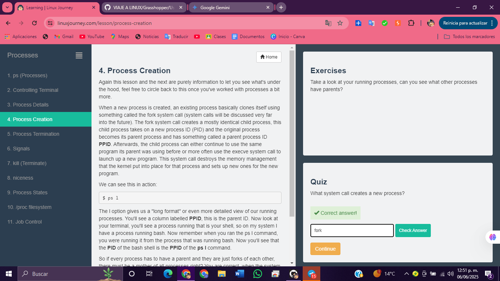

# 5.  Process Termination

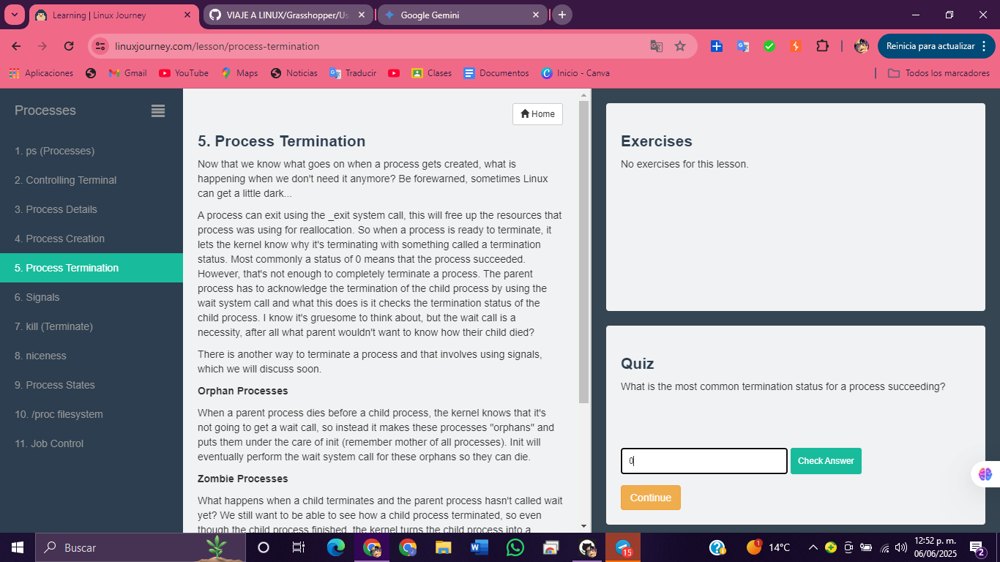

# 6.  Signals

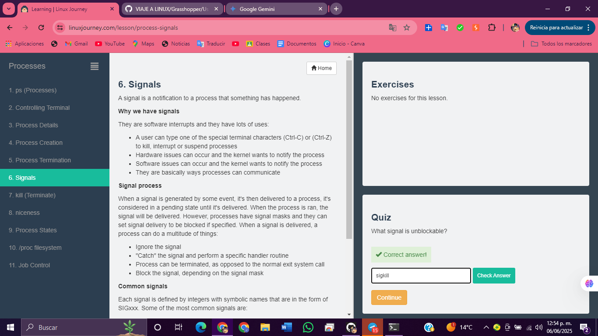           

# 7.  kill (Terminate)

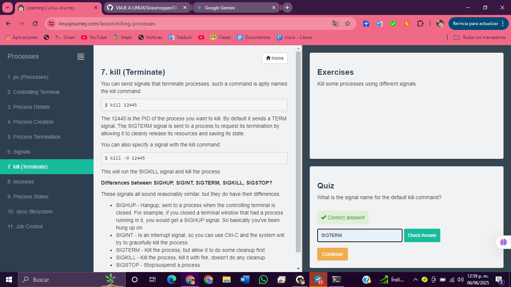

# 8.  niceness

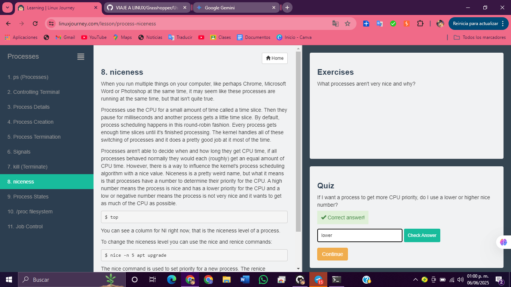

# 9.  Process States

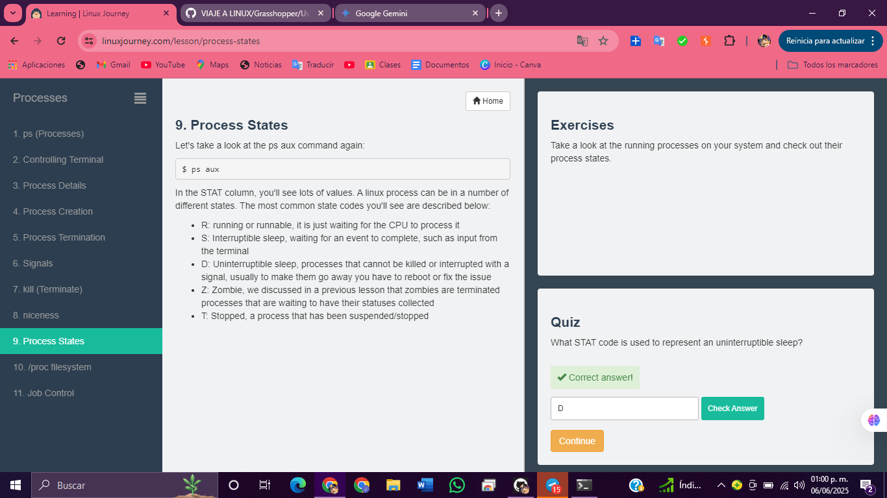

# 10. /proc filesystem

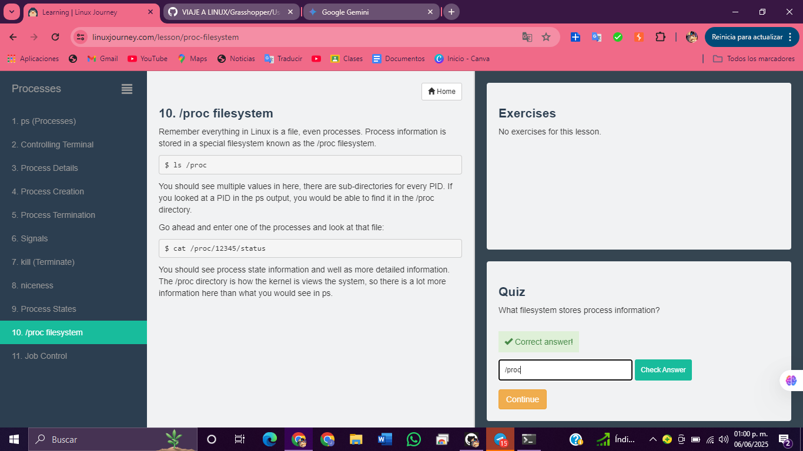

# 11. Job Control

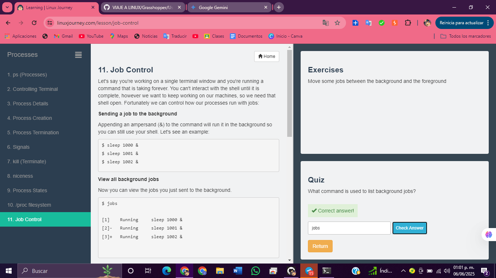