# 1. stdout (Standard out) 

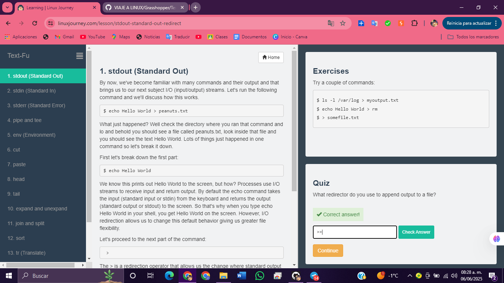

# 2. stdin (Standard In) 

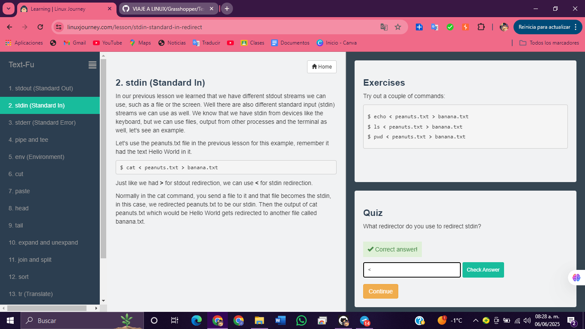

# 3. stderr (Standard error) 

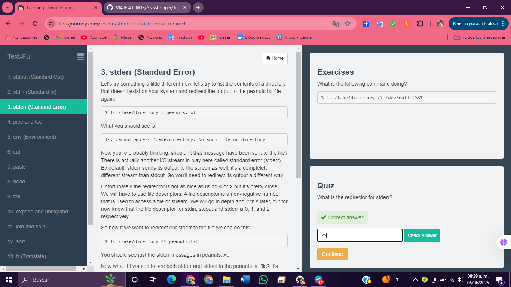

# 4. pipe y tee 

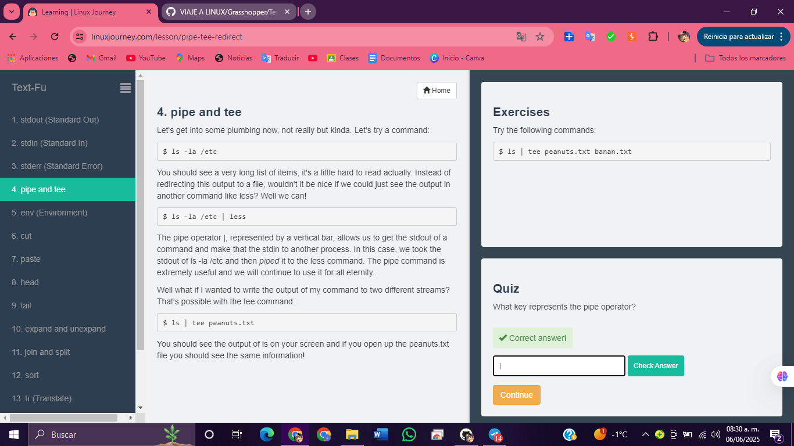

# 5. env (Environment) 

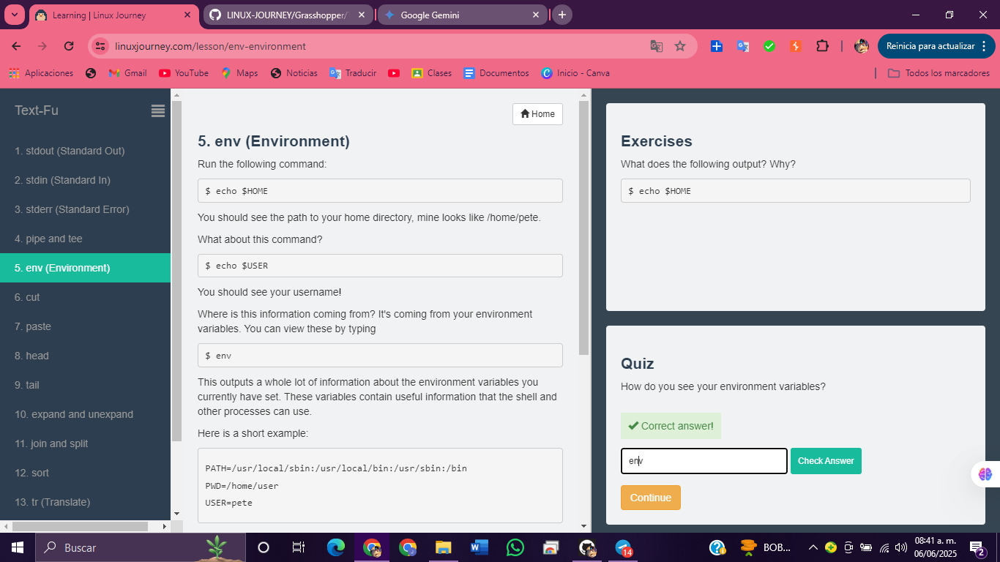

# 6. cortar 

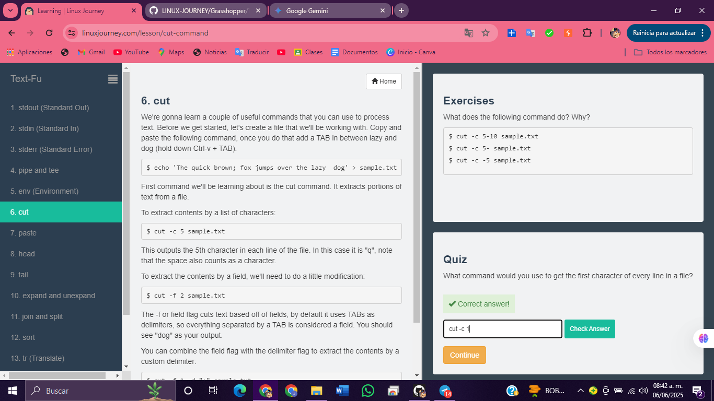

# 7. pegar 

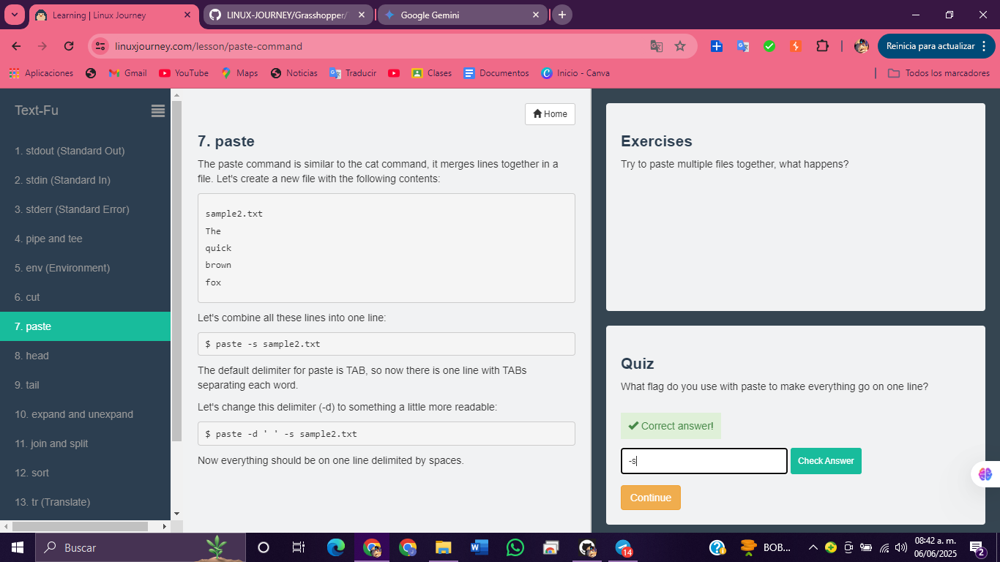

# 8. head 

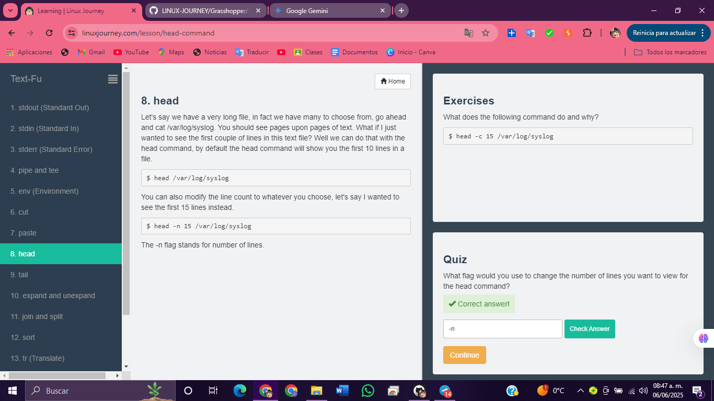

# 9. tail 

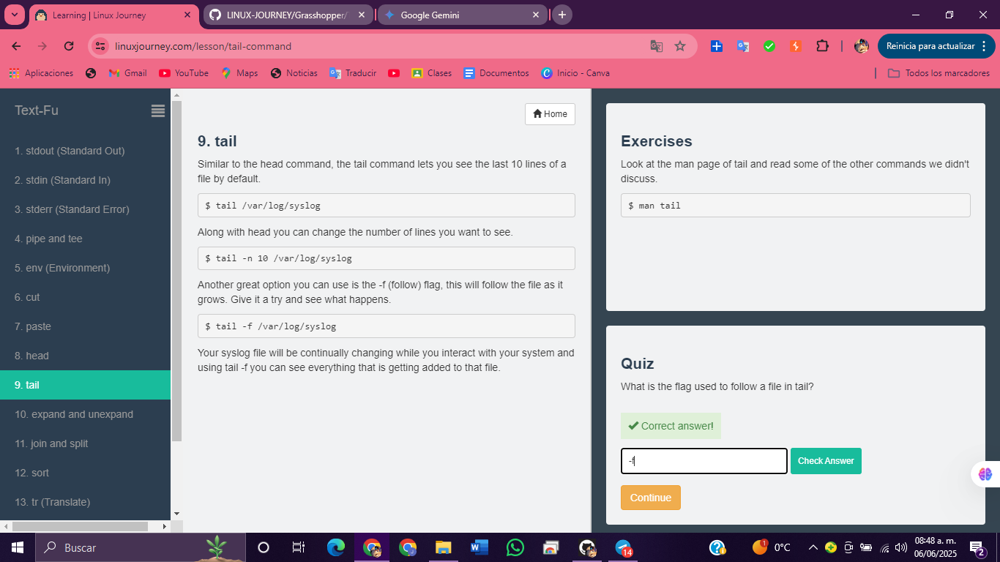

# 10. expandir y desexpandir

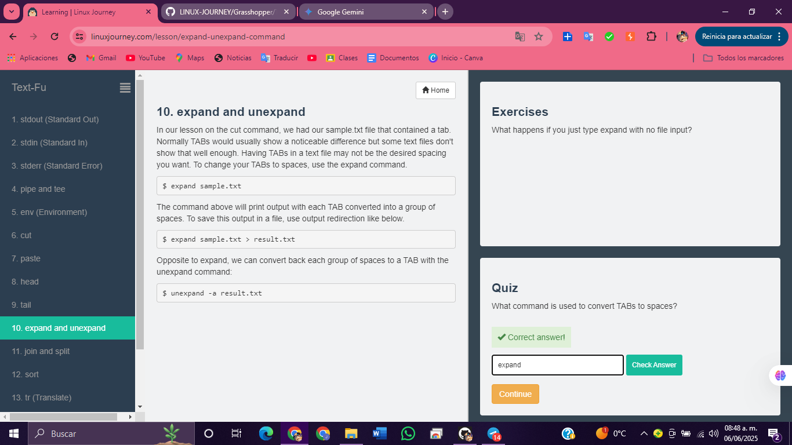

# 11. unir y dividir 

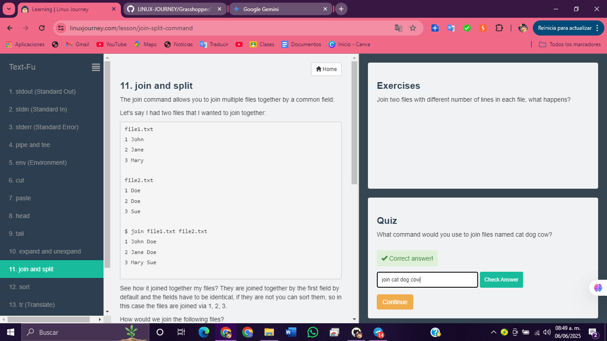

# 12. sort 

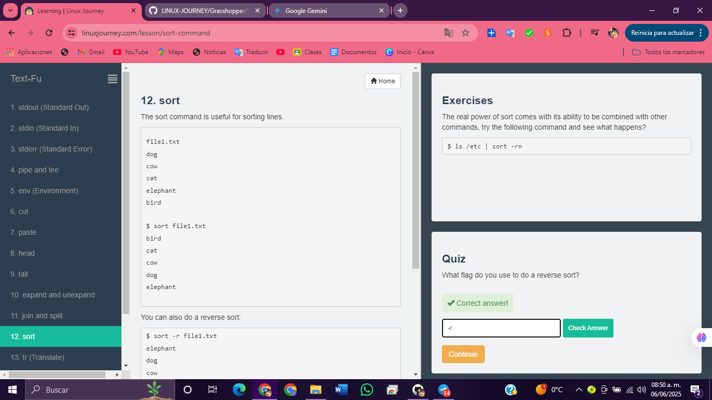

# 13. tr (Traducir) 

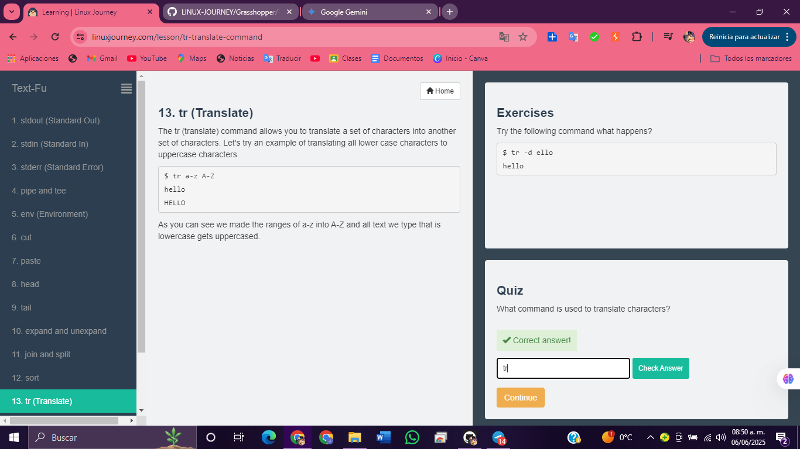

# 14. uniq (Único) 

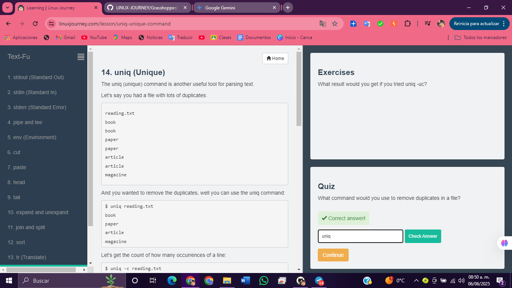

# 15. wc y nl

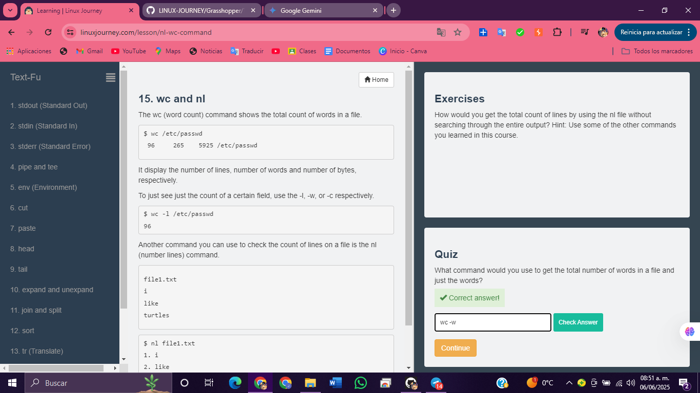

# 16. greptexto alternativo

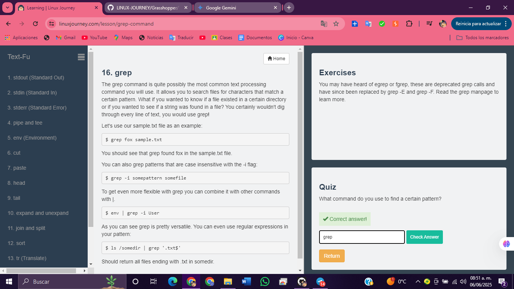