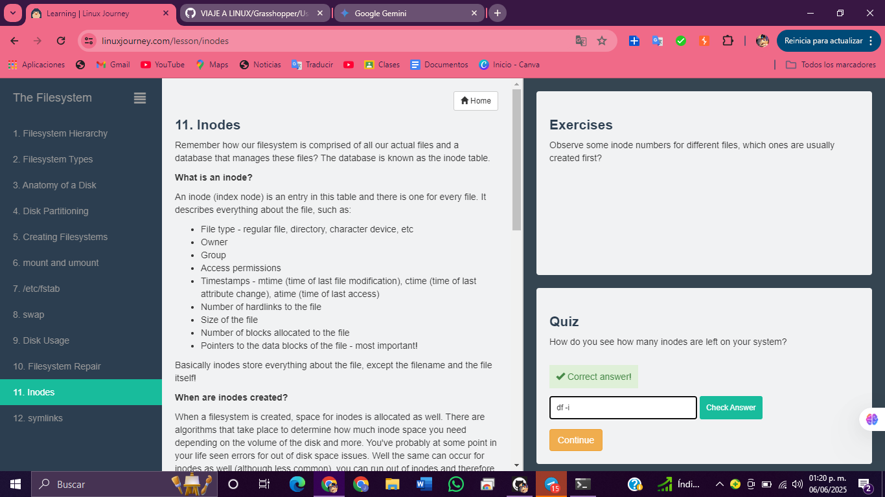

# 1.  Filesystem Hierarchy

# 2.  Filesystem Types

# 3.  Anatomy of a Disk

# 4.  Disk Partitioning

# 5.  Creating Filesystems

# 6.  mount and umount

# 7.  /etc/fstab

# 8.  swap

# 9.  Disk Usage

# 10. Filesystem Repair

# 11. Inodes

# 12. symlinks

