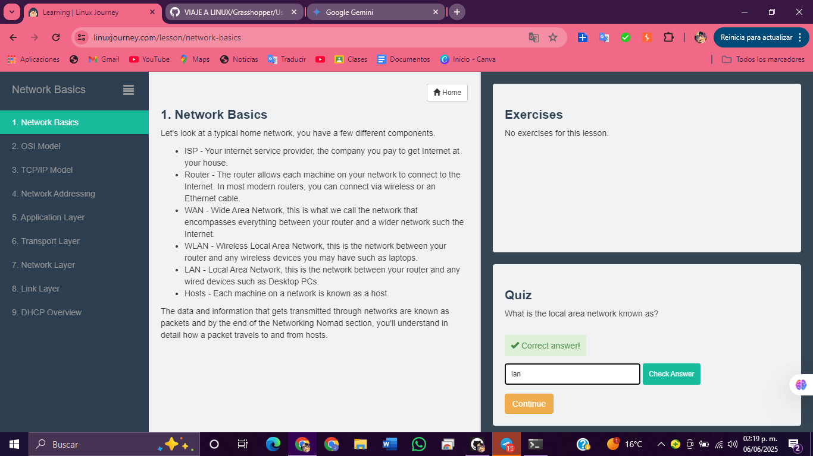
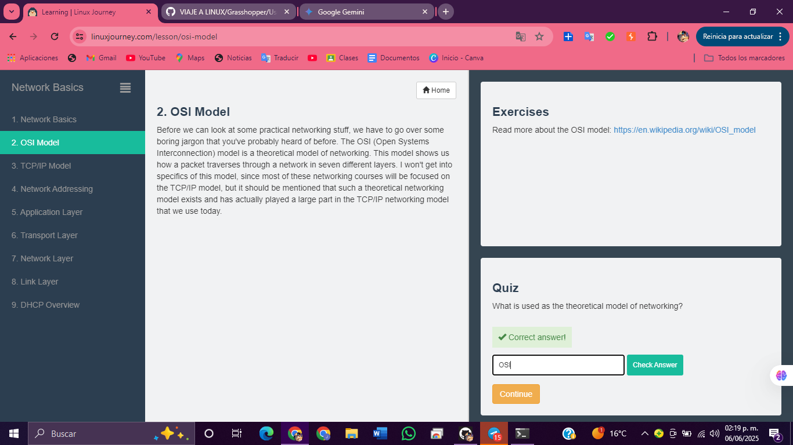
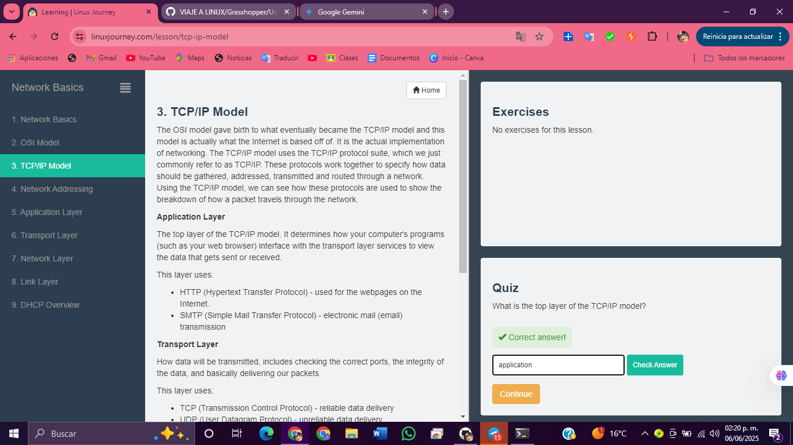
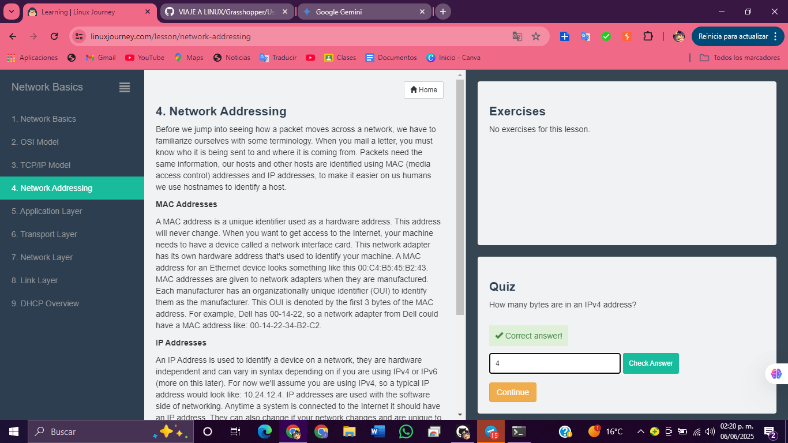
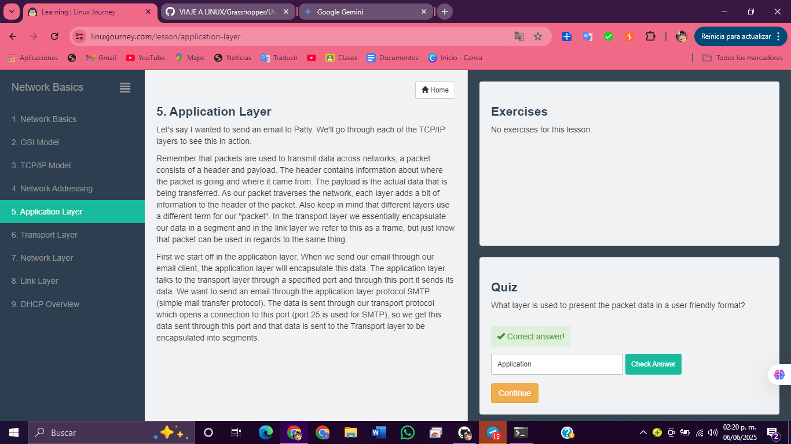
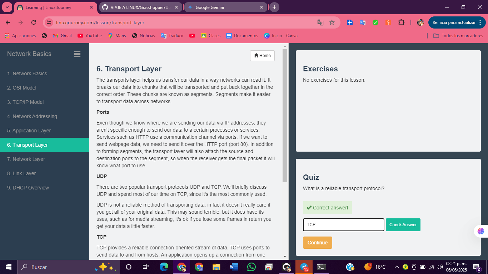
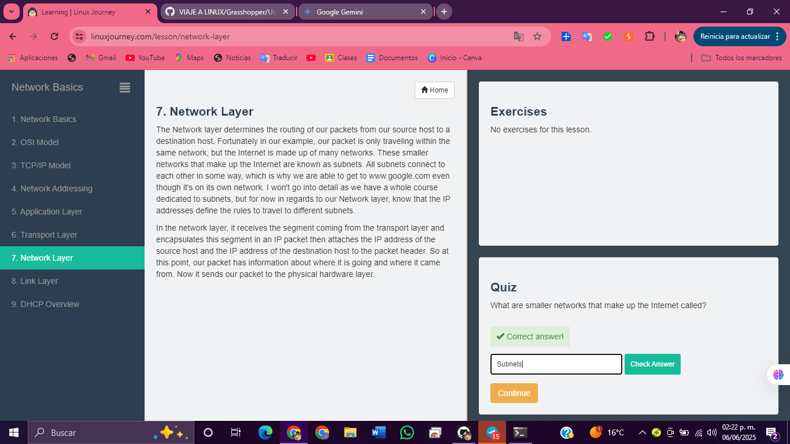
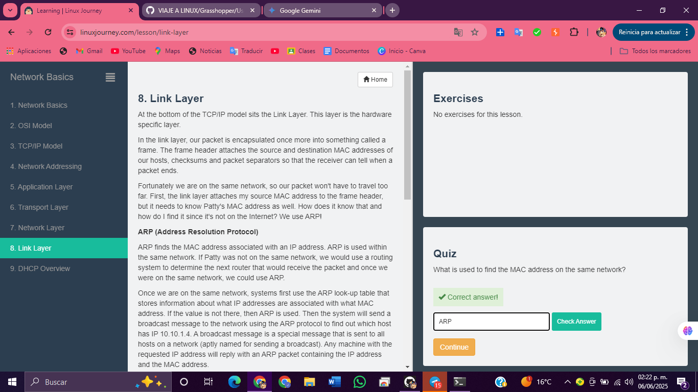

# 1.  Network Basics

# 2.  OSI Model

# 3.  TCP/IP Model

# 4.  Network Addressing

# 5.  Application Layer

# 6.  Transport Layer

# 7.  Network Layer

# 8.  Link Layer

# 9.  DHCP Overview

